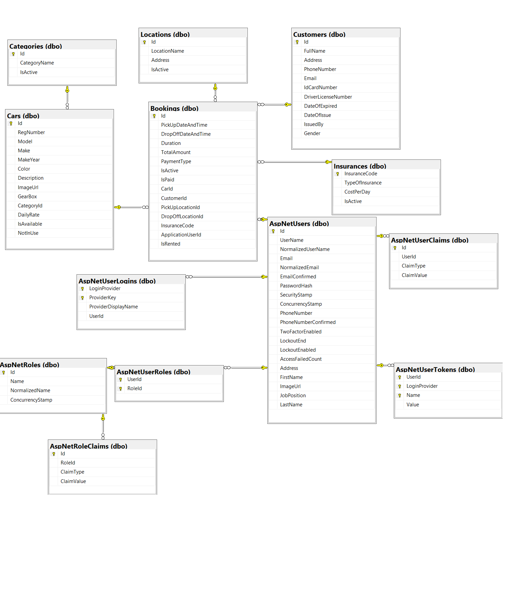

# Rental Car Management System

	
	

## 🔗 Link

* https://rentalcarmanagementsystemweb20221211111053.azurewebsites.net

## 📃 Project Description

This is a Rental Car Management System. The app is built in order to help the rental car companies to easy manage their daily tasks. 
Only logged in users can use the app however firstly they need to reveice a role "User" from the admin as this app is created only for the purpose of the a certain company.
When the users are logged in, they can see the daily tasks: all available cars, all check-ins and check-outs for the day. 
On the navigation bar, they have the availability to go to Car Park where all cars are listed. They also have options to go to
the menu with all boogings, as well as the two menus for all check-ins and check-outs where they can sort the bookings by date.
The Admin has the same options, as well. He also can add/edit/delete cars, locations, incuranses and categories. 
He is able to edit his own profile, as well as others and give them a role.

## 🔨 Built Using

* [ASP.NET Core 6.0](https://github.com/dotnet/aspnetcore)
* [ASP.NET Core WebAPI](https://learn.microsoft.com/en-us/aspnet/core/tutorials/first-web-api?view=aspnetcore-6.0&tabs=visual-studio)
* [Entity Framework Core 6.0](https://github.com/dotnet/efcore)
* [MSSQL Server](https://www.microsoft.com/en-us/sql-server/sql-server-2019)
* [Visual Studio 2022](https://github.com/github/VisualStudio)
* [AutoMapper](https://github.com/AutoMapper/AutoMapper)
* Repository Pattern
* [nUnit](https://github.com/nunit/nunit)
* [Integration testing](https://learn.microsoft.com/en-us/aspnet/core/test/integration-tests?view=aspnetcore-6.0)
* [SQLite(InMemory Db for testing)](https://www.sqlite.org/index.html)
---------
* [JQuery](https://github.com/jquery/jquery)
---------
* [Bootstrap](https://github.com/twbs/bootstrap)
* [AdminLTE3](https://adminlte.io/themes/v3/)
* [Font Awesome](https://fontawesome.com/icons)

## 🌐 Database Diagram

## 👦 Author

* LinkedIn - [Florieta Pencheva](https://www.linkedin.com/in/florieta-pencheva-15713022b/)

